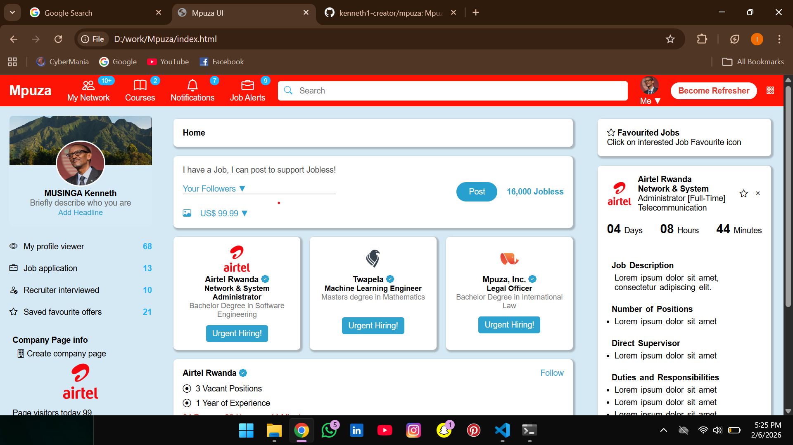

# Mpuza UI

Mpuza UI is a responsive web interface designed for a job networking and recruitment platform.  
It provides users with job postings, profile management, notifications, company pages, and job details in a modern dashboard-style layout.

---

## Output Screenshot

---



## Features

- **Top Navigation Bar**
  - Logo branding
  - Network, Courses, Notifications, and Job Alerts
  - Search functionality
  - User profile shortcut and action buttons

- **Left Sidebar**
  - User profile card with cover image and avatar
  - Profile statistics (profile views, applications, interviews, saved jobs)
  - Company page information
  - Professional group section

- **Main Content Area**
  - Job posting box
  - Featured job cards
  - Detailed job listings with actions (Like, Comment, Share, Favourite)
  - Countdown timers for job deadlines

- **Right Panel**
  - Favourited jobs section
  - Detailed job description view
  - Job countdown timer and requirements

---

## Technologies Used

- **HTML5** – Page structure
- **CSS3** – Styling and layout
- **Bootstrap Icons** – Icons for UI elements

---

## How to Run the Project

1. Download or clone the project:
   ```bash
   git clone https://github.com/kenneth1-creator/mpuza.git


